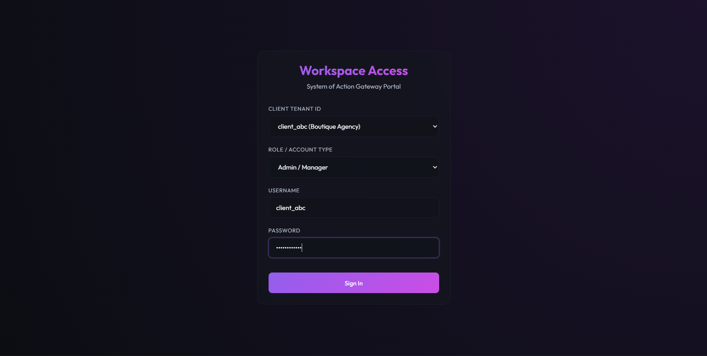
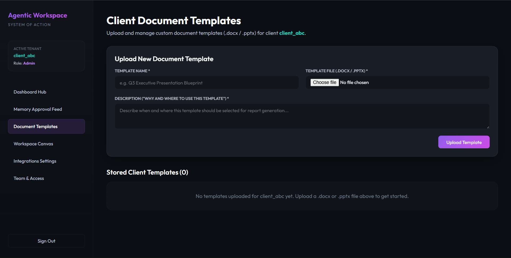
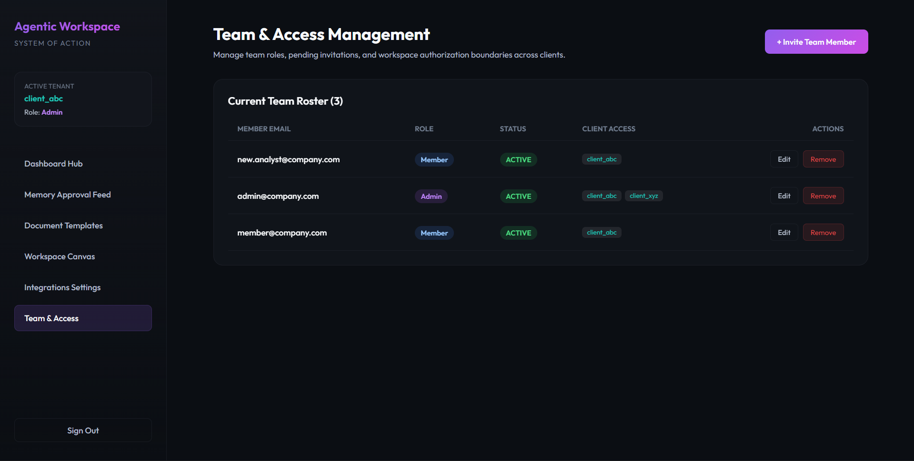

# Agentic Workspace System of Action

A production-ready multi-tenant Agentic System of Action for mid-market professional services.

## Architecture Outline
- **Frontend**: Next.js 14 (App Router) + React 18 + Zustand 4 + Tiptap Editor Canvas.
- **Backend**: FastAPI (Python 3.11+) orchestration gateway.
- **Local Contextual Memory**: ChromaDB offline CPU embeddings using Sentence-Transformers (`all-MiniLM-L6-v2`).
- **Client Relational Vault**: SQLite single-file database (`client_vault.db`) constrained by `tools.yaml` query mapping.
- **Transactional DB**: MongoDB Atlas.
- **AI Engine**: Google Gemini API (via `google-generativeai` SDK).

## Running the Application
Detailed run commands will be populated during system integration.

<h2>Screenshots</h2>

<h4>Login page</h4> 
    

  <h4>Dashboard</h4> 
    
  
  <h4>Client Templates</h4> 
    

  <h4>Report generator</h4> 
    

  <h4>intigrations settings</h4> 
  

  <h4>Team and access management</h4> 
  

